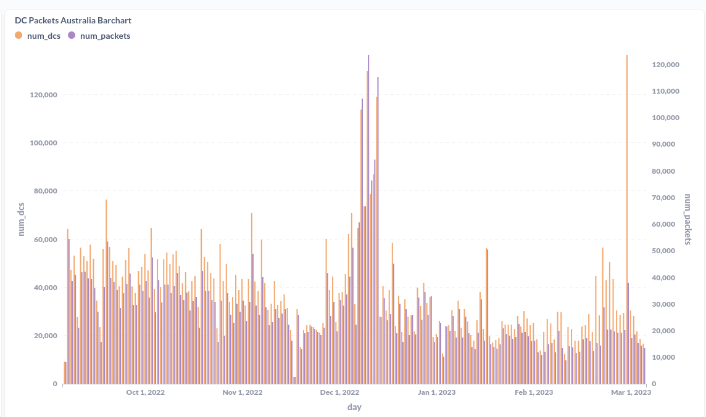
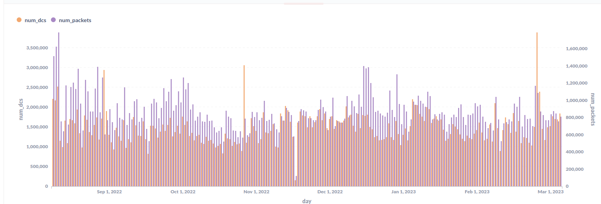
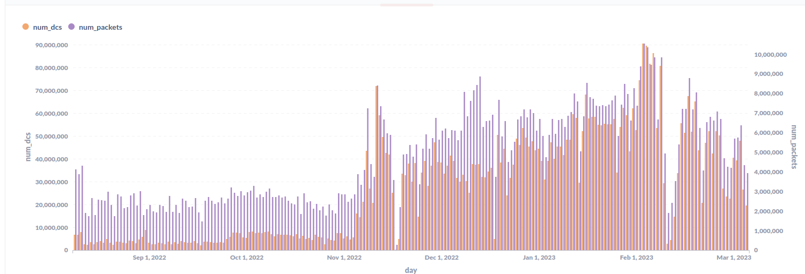

# HIP YZ: Australian Frequency Plan Choice - AU915

- Author(s): [@plainsimpledot](https://github.com/plainsimpledot),
  [@Buckshot22](https://github.com/Buckshot22)(@Jules22), [@mcauser](https://github.com/mcauser),
  [@leogaggl](https://github.com/leogaggl), [@tonysmith55](https://github.com/tonysmith55)
- Start Date: 2023-02-16
- Category: Technical
- Original HIP PR:
- Tracking Issue:
- Status: Daft

## Summary

This Helium Improvement Proposal is designed to allow the investors in the Helium network in Australia to have a voice in determining the best frequency plan for the country, as was originaly proposed by
the Helium Foundation in early 2022. The plan proposed by this HIP is AU915. 

## Motivation

The LoRaWAN regional channel plan is critical to the operation of a LoRaWAN network. There are two channel plans available for use in Australia, AU915 and AS923-1. 
The current Helium network in Australia operates on a AS923-1 channel plan variant. However, the community was not included in the decision-making process for the change in selection of this channel plan from the original AU915.

The reasoning given related to a footnote inserted in a LORA Alliance document by an industry player
which the Alliance themselves have confirmed in no way reflects the LORA Alliance official stance.
The LOARA Alliance have made it very clear and all of their official documentation confirms that they support both AU915 and AS923 in Australia and the Alliance make no distinction between the two.
The LORA Alliance also confirmed that there is absolutely no intention to diminish the AU915
frequency plan in the future.

We believe, backed up by expert opinions including senior members of the LORA Alliance, that the
only effective way to support AS923 is to utilise 16 channel gateways, dual 8 channel gateways or allow investor/operators in
densely populated areas to voluntarily operate on AS923 in line with the Helium IOT POC roadmap goal of reducing congestion.

AU915 is better suited to the Australian environment / use cases due to 
1. The availability of higher power sensors 
2. The ability to allow for roaming on TTN and ThingsIX networks. 
3. The higher likelihood of roaming opportunities and partnerships are likely to bring greater benefits than a single commercial operator who has limited use cases and provides their own coverage in areas they are utilising sensors. 
4. AU915 also allows gateway operators who will move over to alternative networks (such as ThingsIX) the potential to dual purpose their gateways and sensors rather than to lose them from the Helium network completely. Operators in other parts of the world currently have and are utilising this option.

## Stakeholders

1. Australian IOT users.
2. Potential Roaming partners
  -NNNCo currently utilise the AS923 channel plan in Australia however there has been no increase in data usage since the changes (in fact there has been a significant decrease) so it is unlikely that they are utilising any roaming. 
  -TTN, Things IX and any future networks. All of these networks and some that are still in early stages run on the AU915 frequency plans.

Voting will be 1 vote per hotspot asserted in the Australian continent.

## Detailed Explanation

Technical arguments tend to go nowhere in regards to the AU915/AS923, experts point out many advantages and drawbacks in both plans. The biggest technical drawback of AS923 which affects Australia though is the default power level and lack of availability of higher powered sensors.

The primary argument is economical based on the following points-
1. Based on the ETL data below we can see a significant decrease in data usage in Australia compared to the rest of the world as a result of the move to AS923 (Dual Plan)
2. Australia has a vibrant community of dedicated LORAWAN enthisasts who were advocating for Helium and actively building the network. Since the change many we have heard from many of the largest builders and evangalists who have left and become dissilusioned with Helium.
3. Businesses are moving their deployments away from Helium due to the issues supporting AS923 to other AU915 options. See below for some business impact statements we have received.
4. Australia is in a unique position in that it has two valid choices fully supported by the Lora Alliance. Allowing the Australian community the opportunity to decide on their future will restore a lot of faith in the Helium ecosystem that has been lost over the past six months.

The proposed change is extremely simple in that it is reverting to a known working configuration (AU915) utilising a LORA Alliance approved frequency plan at up to 30 dBm EIRP which is within the permitted range for Australia.

It is imperative that the Community participates in the decision-making process. The previous lack of Community participation in the decision-making process has led to the need for this proposal. It is essential to recognise that not allowing the Community to participate in the decision-making process may lead to significant risks, such as a lack of community adoption, mistrust, and a loss of community engagement.

The risks in not switching to AU915 are that the current trend downwards in both operating gateways and data usage will contine to show the dramatic decline it has shown since the deployment of the
'dual plan'
### Australia Usage

### United States Usage

### Worldwide Usage

We have received the following impact statements from businessses who were previously building and promoting Helium solutions in Australia-

1.  "Helium Mining PTY LTD, Helium Host PTY LTD and Helium Mining Sydney were running 58 gateways and 45 sensors on the Helium network at the time of the change to the     AS923 'Dual Plan'.
  We still have on hand a further 100 gateways and 300 sensors we had planned to roll out. 
  We have currently begun moving these units to alternative networks and plan to move them all to AU915 networks as a result of the change. 
  We had two major clients in late stages of negotiations whcich we subsequently lost due to the change to AS923.
  We would only be able to continue to utilise the Helium network if it was to re-instate the AU915 frequency plan."

2.  "Rural Network PTY LTD would have 55 gateways on the Helium network if the frequecy remained on AU915. The vast majority of these are deployed in rural areas, with   no other Helium gateways. The Riverland region encompasses 9,386 square kilometers and is mostly prime irrigated horticulture.

  We run a large number of sensors, however due to the nature of our main clients, we cannot disclose numbers. Sensor deployments include-
   - Pump Monitoring along the River Murray (Water Utility)
   - Bio Security Bins (fruit fly prevention) accross the whole Riverland region (Govt. Department) 
   - Irrigation (Soil moisture, pressure)
   - Water quality monitoring
   - Biodiversity monitoring (wildlife traps)
   - Greenhouse monitoring
   - Enviromental monitoring (rainfall, weather)  

  The bulk of the above deployments in our region require the higher powered sensors available under AU915 and have not been sustainable under the AS923 'Dual Plan'

  The change to the dual plan cost my business significant time, disgruntled clients and lost goodwill"

At the very least the operator/investors in Australia should be presented the potential benefits of each option and be allowed to make the decision based on what is best for the network and therefore
their investments.

Further, the landscape has changed with renewed growth of public LoRaWAN operators in the region such as ThingsIX on AU915.

AS923 support can and will be looked at for future implementation as a means to reduce congestion in built up areas by allowing hotspots in congested hexes to switch to this plan to avoid diminished earnings and to allow for 16 channel or dual gateway operations. This is already part of the Helium Roadmap as outlined by Helium Foundation Director Proof-of-Coverage.

This would provide AS923 support where required while allowing full AU915 support across public networks ensuring Helium participates in the growth of the overall LoRaWAN ecosystem. This would also be helping to solve congestion issues in the few metropolitan areas of Australia. 

## Drawbacks

The only potential drawbacks would be the short to medium term lack of roaming support to AS923.
This has proven to be negligible and in fact the loss of AU915 devices which have moved to alternatives as a result of the plan change and associated issues, has provided a significant nett decrease in data traffic and coverage. Therefore the move to AU915 is likely to result in recovering some of those losses and provide an immediately positive outcome.

This is the course of action recommended by all of the experts we have consulted with including senior members of the LORA Alliance.

## Rationale and Alternatives

Australia has two valid frequency plans available under local laws and supported by the LORA Alliance. The Alliance make no official distinction between the two and both are freely available for use.

The availability of gateways and sensors suitable for a particular regional plan must be considered. Research indicates that both regional plans have supply chain support from Manufacturers making the selection seem less critical in this regard. However, due to the complication with needing to configure AU915 sensors to operate under the AU923-1 configuration there is significant additional work required to accomplish this. This is detracting from the IoT experience placing at risk the speed of IoT adoption and slowing expansion of network coverage.

This HIP simply provides the Australian community the ability to make the choice of plan to be used in the country, weighing up all of the factors and the changing lancdscape with the introduction of ThingsIX.

Doing so brings the decision in line with the Helium governance principles and the advertised "People's Netowrk". As has been outlined above, a Yes vote does not preclude future support for AS923, however such support should be introduced in a manner that does not diminish full AU915 support to allow roaming from all AU915 networks, while introducing full support for AS923. 

If or when AS923 support was explored in the future, such development should be evaulated via a cost/benefit analysis which was one of the key pieces missing in the November changes. 

"Full Support" in this context means that any device configured for the frequency plan in question will be able to operate on the network and other networks on the same frequency plan without any requirement for configuration changes.

The public networks currently and planned for Australia, all operating on AU915, are much more likely to provide roaming opportunities than the commercial operators who are much more likely to, and usually do, deploy sensors in conjunction with their own gateway infrastructure.

## Voting mechanism

It is proposed to use the standard Helium on-chain voting system [HeliumVotes](https://heliumvote.com) to allow any wallet to vote on this HIP. See [Voting on Helium](https://docs.helium.com/community-voting/) documentation on Helium Docs.

Since this is a change only affecting the Australian Region it should be made clear that only wallets containing hotspots asserted in the Australia region will be eligible to be counted.

YES Vote will be the total number of hotspots asserted to the AU region contained in wallets that have burned a vote transaction to the **FOR** wallet address.

NO Vote will be the total number of hotspots asserted to the AU region contained in wallets that have burned a vote transaction to the **AGAINST** wallet address.

## Deployment Impact

This change will impact any gateway asserted in the Australia region.

As the change will need the involvement of the maker community (although the end-state will be known as it effectively reverts to the gateway state prior to November 17).

Since this will require the change of chain-vars the proposal would be to revert this as part of the migration to the new routing infrastructure and LNS implementation post the Solana chain migration.

Current device users will have to revert changes to their Sensors. Since the number of devices and data usage has been dropping past 17th November this should be done as a matter of urgency as soon as teh chain migration has been completed and when manufacturers are required to switch over to the new gateway-rs implementation switching from LNS State channels to the NetID based routing infrastructure (coupled with the Chirpstack LNS switch).

The following documentation will need to be modified.

- [Frequencies on the Helium Network](https://docs.helium.com/lorawan-on-helium/frequency-plans)
- [Frequencies by Region on the Helium Network](https://docs.helium.com/lorawan-on-helium/region-plans)

The implementation procedure is the reversal of the change made on November 17th 2022 and is reversable in the same way.

The impact should be dramatically less since this would re-instate the plan that was in place for the years leading up to November 17th and was extensively tested.

## Success Metrics

1. We expect to see an upswing in the number of hotspots operating in the country as well as data usage
towards what it was pre Nov 17. 
2. We expect a restoration in confidence in the Helium governance
process and towards Helium as a whole. 
3. We expect that aligning with the current and emerging public operators who all run on AU915 as the preferred frequency plan for the country, will see some REAL
opportunities for roaming. 
4. We expect that by remaining on the preferred frequency plan we will not only retain gateways and sensors that are or will continue to move to other networks be able to remain on the Helium platform, rather than be lost to the network, we also have the opportunity to attract operators who come into other networks to also participate in the Helium ecosystem with their gateways and sensors.
